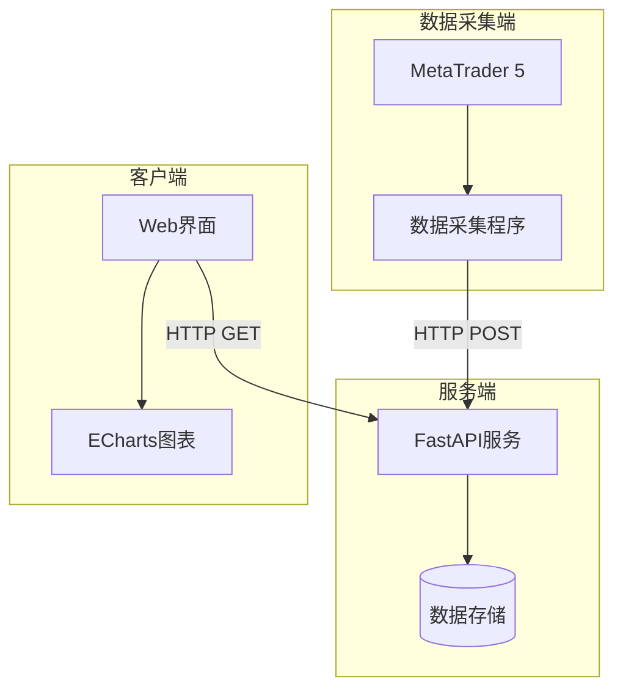

# MT5实时K线图数据服务


一个基于MetaTrader5的实时K线数据采集和展示系统，支持多品种、多时间周期的数据采集和可视化。

## 系统架构



## 功能特点

- 🚀 实时数据采集：自动从MT5采集最新行情数据
- 📊 可视化展示：使用ECharts绘制专业K线图
- 🔐 安全认证：JWT token认证机制
- 💾 灵活存储：支持Redis或内存存储
- 📱 响应式设计：适配大屏显示
- ⚡ 实时更新：自动刷新最新数据
- 🎛️ 多功能控制：支持多品种、多时间周期切换

## 项目结构

```
my-candle-charts/
├── data_collector/          # 数据采集端
│   ├── collector.py        # 数据采集主程序
│   ├── requirements.txt    # 依赖包列表
│   └── config.ini         # 配置文件
├── server/                 # 服务端
│   ├── app.py            # FastAPI应用
│   ├── requirements.txt  # 依赖包列表
│   └── config.ini       # 服务器配置
└── client/               # 客户端
    └── index.html      # Web界面
```

## 快速开始

### 1. 环境要求

- Python 3.8+
- MetaTrader 5
- Redis（可选）

### 2. 安装步骤

1. 克隆项目：
```bash
git clone <repository-url>
cd my-candle-charts
```

2. 安装数据采集端依赖：
```bash
cd data_collector
pip install -r requirements.txt
```

3. 安装服务端依赖：
```bash
cd ../server
pip install -r requirements.txt
```

### 3. 配置

#### 数据采集端配置 (data_collector/config.ini)
```ini
[server]
url = http://your-server-url/api/v1
api_key = your-api-key

[mt5]
symbols = ["EURUSD", "GBPUSD", "USDJPY"]
```

#### 服务端配置 (server/config.ini)
```ini
[server]
host = 0.0.0.0
port = 8000

# Redis配置（可选）
[redis]
host = localhost
port = 6379
password = your_redis_password

[jwt]
secret_key = your_secret_key_here
algorithm = HS256
access_token_expire_days = 365
```

### 4. 运行

1. 启动服务端：
```bash
cd server
python app.py
```

2. 启动数据采集端：
```bash
cd data_collector
python collector.py
```

3. 部署客户端：
   - 修改 client/index.html 中的 API_URL 和 API_TOKEN
   - 使用Web服务器部署或直接打开index.html

## API文档

### 认证

所有API请求（除了生成token）都需要在header中包含Bearer token：
```
Authorization: Bearer <your_token>
```

### 接口列表

#### 1. 生成访问令牌
- 端点：`POST /api/v1/token`
- 参数：
  - client_id: 客户端标识
- 返回示例：
```json
{
    "access_token": "eyJhbGc...",
    "token_type": "bearer",
    "expires_in": "365天"
}
```

#### 2. 更新K线数据
- 端点：`POST /api/v1/kline`
- 请求体示例：
```json
{
    "symbol": "EURUSD",
    "timeframe": "M1",
    "data": [{
        "time": "2024-01-21 10:00:00",
        "open": 1.0891,
        "high": 1.0893,
        "low": 1.0890,
        "close": 1.0892,
        "volume": 100
    }],
    "timestamp": "2024-01-21T10:00:00"
}
```

#### 3. 获取K线数据
- 端点：`GET /api/v1/kline/{symbol}/{timeframe}`
- 参数：
  - symbol: 交易品种
  - timeframe: 时间周期
- 返回格式同上

#### 4. 获取可用交易品种
- 端点：`GET /api/v1/symbols`
- 返回示例：
```json
["EURUSD", "GBPUSD", "USDJPY"]
```

## 测试方法

### 1. 测试token生成
```bash
curl -X POST "http://localhost:8000/api/v1/token?client_id=test_client" -H "accept: application/json"
```

### 2. 测试数据更新
```bash
curl -X POST "http://localhost:8000/api/v1/kline" \
  -H "Authorization: Bearer <your_token>" \
  -H "Content-Type: application/json" \
  -d '{"symbol":"EURUSD","timeframe":"M1","data":[...]}'
```

### 3. 测试数据查询
```bash
curl -X GET "http://localhost:8000/api/v1/kline/EURUSD/M1" \
  -H "Authorization: Bearer <your_token>"
```

## 常见问题

1. **Q: 为什么数据没有实时更新？**
   A: 检查数据采集端是否正常运行，以及网络连接是否正常。

2. **Q: 如何修改更新频率？**
   A: 在数据采集端的collector.py中修改更新间隔时间。

3. **Q: 是否支持其他数据源？**
   A: 目前仅支持MT5，但可以通过修改collector.py来支持其他数据源。

## 开发计划

- [ ] 添加更多技术指标
- [ ] 支持多主题切换
- [ ] 添加数据导出功能
- [ ] 支持更多时间周期
- [ ] 优化移动端显示

## 贡献指南

1. Fork 项目
2. 创建特性分支
3. 提交更改
4. 推送到分支
5. 创建 Pull Request

## 许可证

MIT License

# Candle Charts API 部署指南

## 前置要求

- Docker
- Docker Compose
- SSL证书文件（需要放在 `nginx/ssl` 目录下）
  - cert.pem（证书文件）
  - key.pem（私钥文件）

## 目录结构
```
.
├── docker-compose.yml
├── nginx
│   ├── Dockerfile
│   ├── conf.d
│   │   └── default.conf
│   └── ssl
│       ├── cert.pem
│       └── key.pem
└── server
    ├── Dockerfile
    ├── app.py
    └── requirements.txt
```

## 部署步骤

1. 准备SSL证书
   - 将SSL证书文件 `cert.pem` 和私钥文件 `key.pem` 放入 `nginx/ssl` 目录

2. 启动服务
   ```bash
   docker-compose up -d
   ```

3. 验证服务
   - 访问 https://你的域名/docs 查看API文档
   - 访问 http://你的域名 会自动重定向到https

## 服务说明

- Nginx: 443端口(HTTPS)和80端口(HTTP重定向)
- FastAPI: 内部8000端口
- Redis: 内部6379端口

## 注意事项

- 请确保SSL证书的正确性和有效性
- 首次启动时会自动创建docker网络和数据卷
- Redis数据持久化存储在docker volume中 